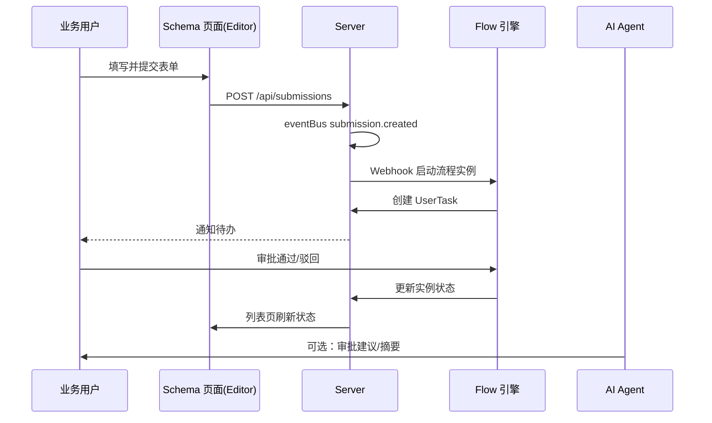
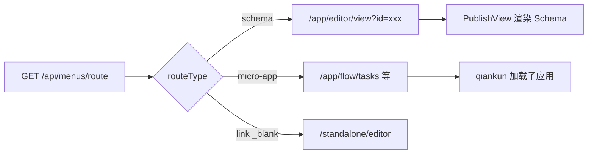
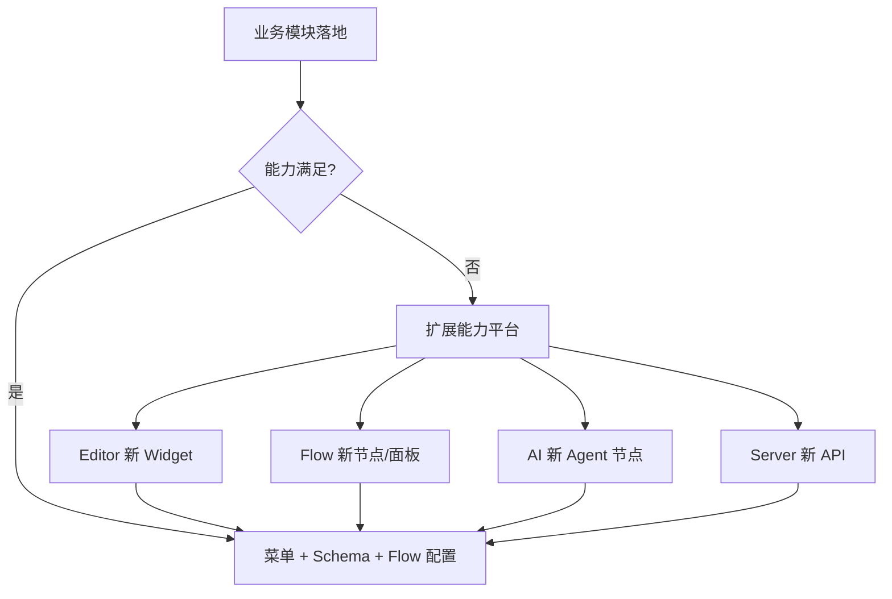

# 01 — 架构分析

## 1. 平台定位

Schema 业务平台是一个 **Schema-First 低代码业务系统**，面向政务、OA、人事等场景：

```
业务能力 = Schema 页面（Editor） + 审批流程（Flow） + 智能增强（AI）
业务入口 = Shell 动态菜单 + 鉴权 + 微前端容器
数据与权限 = Server（MongoDB + RBAC + 多租户）
```

> **架构决策：** 不建设独立 Admin 微应用。系统管理、OA、人事等**所有 CRUD / 列表 / 表单 / 统计界面**均通过可视化编辑器 Schema 搭建。Shell 仅保留登录、布局、菜单等基础设施。详见 [06-Schema-First 架构决策](./06-schema-first-architecture.md)。

**双重目标：**

| 目标 | 说明 |
|------|------|
| 业务完整度 | 覆盖工作台、OA、人事、政务、**财务、审计、计装、报表报告**、系统管理等 **12 模块、80+ 界面** |
| 能力平台强化 | 每落地一个业务模块，反向验证并扩展 Editor Widget、Flow 节点、AI Agent 能力 |

## 2. 分层架构

```
┌─────────────────────────────────────────────────────────────┐
│  schema-form-shell（业务平台壳）                              │
│  登录 / SSO / 动态菜单 / ClassicSidebarLayout / Standalone   │
└───────────────────────────┬─────────────────────────────────┘
                            │ qiankun + props 通信
        ┌───────────────────┼───────────────────┐
        ▼                   ▼                   ▼
┌───────────────┐   ┌───────────────┐   ┌───────────────┐
│ schema-form-  │   │ schema-form-  │   │ schema-form-  │
│ editor        │   │ flow          │   │ ai            │
│ 可视化编辑器   │   │ BPMN 流程引擎  │   │ Agent / RAG   │
└───────┬───────┘   └───────┬───────┘   └───────┬───────┘
        │                   │                   │
        └───────────────────┼───────────────────┘
                            ▼
              ┌─────────────────────────┐
              │ schema-form-server       │
              │ REST API + EventBus      │
              │ Webhook + Socket.IO      │
              └─────────────────────────┘
                            │
              ┌─────────────────────────┐
              │ platform-shared          │
              │ flow-shared              │
              │ 公共组件 / qiankun 配置   │
              └─────────────────────────┘
```

### 2.1 Shell 职责边界

**负责：**

- JWT 鉴权、路由守卫、SSO 回调
- 从 `GET /api/menus/route` 渲染侧边栏
- 两种容器：`/app/{app}/*`（带菜单）、`/standalone/{app}/*`（全屏）
- 向子应用下发 `createSubAppProps()`（token、navigateTo、openInNewTab 等）
- 基础设施页：登录、SSO、布局容器；首页与微应用管理为**过渡性内置页**，目标迁移至 Schema

**不负责：**

- 任何业务 CRUD 界面（含系统管理）—— 一律 Editor Schema
- 审批逻辑（由 Flow 引擎执行）
- 智能分析逻辑（由 AI Agent 执行）

### 2.2 菜单驱动的页面类型

| routeType | 渲染方式 | 典型用途 |
|-----------|----------|----------|
| `schema` | `/app/editor/view?id={schemaId}` | 列表、表单、统计、大屏 |
| `micro-app` | `/app/{editor\|flow\|ai}/{route}` | 待办收件箱、Schema 管理、Agent 编排 |
| `link` | 外部 URL 或新窗口 | 第三方系统、设计器全屏入口 |
| Shell 内置 | `/`、`/admin/micro-apps` | 首页、微应用管理（过渡，目标 Schema 化） |

菜单字段定义见 `schema-form-shell/src/types/menu.ts`。

## 3. 三能力协同模型

### 3.1 可视化编辑器（Editor）

**能力域：** 列表、表单、详情、统计图表、数据大屏、管理类 Widget。

**Widget 分组（当前）：**

| 分组 | 代表组件 | 业务用途 |
|------|----------|----------|
| layout | Card, Tabs, 多列布局 | 页面结构 |
| form | Input, Select, Date, Upload, UserSelector | 数据采集 |
| table | Table, AdvancedTable | 台账列表 |
| chart | Bar/Line/Pie/Gauge/Heatmap 等 | 统计与大屏 |
| business | UserManagement, RoleManagement, ApprovalComment | 系统管理与审批 UI |
| container | Form, Dialog, Iframe, MicroApp | 容器与嵌入 |
| action | Button, ToolbarButtons | 操作触发 |

**生命周期：** 设计 → 草稿 → 发布 → 菜单绑定 schemaId → 运行时 `/view` 渲染。

### 3.2 流程引擎（Flow）

**能力域：** BPMN 设计、流程实例、任务收件箱、审批轨迹、监控统计。

**内置模板（Server seed）：**

| 模板 | 分类 | 节点特征 |
|------|------|----------|
| 请假审批 | 人事 | 线性：部门经理 → HR |
| 报销审批 | 财务 | 金额网关分支 |
| 采购审批 | 采购 | 金额分级 + 财务确认 |
| 入职审批 | 人事 | 并行：IT + 行政 |
| 离职审批 | 人事 | 并行：HR + IT → 财务 |

**与 Editor 集成路径：**

1. 表单提交 → `eventBus.emit('submission.created')`
2. Webhook 配置 `flowDefinitionId` → 自动 `startInstance`
3. 审批人在 Flow `/tasks` 或 Schema 审批详情页处理任务

### 3.3 AI 平台

**能力域：** 多 Agent 对话、Agent 工作流编排、RAG 知识库、SSE 流式、HITL 确认。

**业务增强场景：**

| 场景 | AI 能力 | 状态 |
|------|---------|------|
| 制度/政策问答 | RAG 语义检索 | ✅ |
| 审批建议 | `approval-suggestion` API | ⚠️ 占位 |
| 智能指派人 | `recommend-assignee` API | ⚠️ 占位 |
| 文档摘要 | Agent 工作流 + LLM | ✅ |
| Schema/Flow 生成 | Editor/Flow Agent + MCP | ✅ |

## 4. 核心数据流

### 4.1 业务申请 → 审批 → 归档



### 4.2 菜单 → 页面渲染



### 4.3 能力平台反哺



## 5. 当前现状评估

### 5.1 已有

| 层级 | 内容 |
|------|------|
| Shell | 双容器、动态菜单、微应用管理、SSO |
| Server | 完整 RBAC、组织、Schema、Submission、Flow、AI、Webhook、审计 |
| Editor | 60+ Widget、发布运行时、用户/角色管理 Widget |
| Flow | BPMN 设计器、任务、监控、5 个内置模板 |
| AI | 对话、RAG、Agent 工作流、MCP |
| 菜单 seed | 首页、系统管理(2)、三设计器入口 |

### 5.2 缺失（业务视角）

| 类别 | 缺口 |
|------|------|
| 业务界面 | OA / 人事 / 政务 / 财务模块零落地 |
| 首页 | HomeView 仅占位文案 |
| 菜单 | 无业务菜单、无 `/app/flow/tasks` 等待办入口 |
| 集成 | Schema 提交 ↔ Flow 启动的标准配置文档与 seed 示例缺失 |
| AI 业务化 | 审批建议等 runtime API 仍为占位 |

### 5.3 已知技术债（影响落地）

| 问题 | 影响 | 修复归属 |
|------|------|----------|
| Flow 菜单路径 `/standalone/flow/design` | 404，应为 `/designer` | server seedMenus |
| routing.md 与实现不一致 | 文档误导 | shell docs |
| FgMicroApp 基于 micro-app 非 qiankun | 嵌入 Flow 详情可能不兼容 | editor |
| GlobalSearch 占位 | 工作台搜索不可用 | shell |
| 微应用管理仍为 Shell 内置页 | 与 Schema-First 原则不一致 | 迁移为 Schema + Widget（可选） |

## 6. 账号与环境

| 项 | 值 |
|----|-----|
| 默认管理员 | `admin` |
| 默认密码 | `admin123456` |
| 默认租户 | `000000` |
| Shell 端口 | 5050 |
| Base Path | `/schema-platform/` |
| Seed 脚本 | `schema-form-server/scripts/seed.ts` |

本地与线上须保持一致：部署后执行 seed，或通过管理端重置密码。

## 7. 设计决策记录

| 决策 | 理由 |
|------|------|
| **不建 Admin 微应用，Schema-First** | 系统管理与业务界面统一低代码路径；Editor Widget 已覆盖 RBAC |
| 业务页用 Schema 而非 Shell Vue 页面 | 低代码可配置、可版本化、可 AI 生成 |
| 设计器用 standalone 新标签 | 全屏编辑体验，与业务浏览分离 |
| 待办优先 micro-app 嵌入 | Flow 任务逻辑复杂，复用子应用而非重写 Widget |
| 能力扩展在子项目而非 Shell | 符合 monorepo 隔离规则，Shell 保持薄 |

---

下一篇：[02-能力缺口与扩展清单](./02-capability-gap-and-extensions.md)
