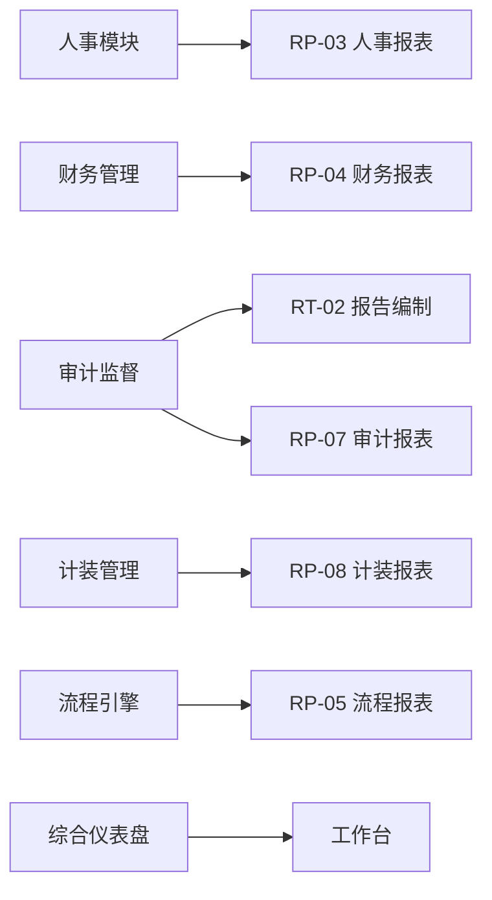

# 模块落地 — 报表与报告

> 优先级：**P1–P2** | Phase：**2–3**  
> **报表** = 数据统计、查询、导出、大屏 | **报告** = 周期性/专题分析文档、编制审批发布  
> 架构：全部 **Schema 页**（报表偏 chart+table，报告偏 richtext+flow）

## 1. 模块概述

| 概念 | 定义 | 典型产出 | 搭建侧重 |
|------|------|----------|----------|
| **报表** | 结构化数据聚合、筛选、导出 | 月报表、台账汇总、领导看板 | Chart + AdvancedTable + 导出 |
| **报告** | 叙述性文档 + 分析结论 + 审批发布 | 年度总结、审计报告、运行分析报告 | Richtext + Flow + AI 生成 |

二者可在同一菜单目录下，通过 Schema 类型区分；报告类与 [07-审计监督](./07-audit-compliance.md) 中 AU-11 可复用编制模式。

## 2. 界面清单

### 2.1 报表中心

| # | 界面 | Schema code | 数据源 | Phase |
|---|------|-------------|--------|-------|
| RP-01 | 报表中心首页 | `report-center-home` | 目录+快捷 | P2 |
| RP-02 | 综合统计仪表盘 | `report-dashboard-general` | dashboard API | P1 |
| RP-03 | 人事报表 | `report-hr-summary` | submissions HR | P2 |
| RP-04 | 财务报表 | `report-fin-summary` | submissions 财务 | P2 |
| RP-05 | 流程效率报表 | `report-flow-efficiency` | flow stats API | P2 |
| RP-06 | OA 运营报表 | `report-oa-summary` | submissions OA | P2 |
| RP-07 | 审计报表 | `report-audit-summary` | 审计 submission | P3 |
| RP-08 | 计装报表 | `report-metrology-summary` | 计装 submission | P3 |
| RP-09 | 自定义查询 | `report-adhoc-query` | 动态筛选 E-20 | P3 |
| RP-10 | 报表订阅 | `report-subscription` | 定时 Agent | P3 |
| RP-11 | 数据导出中心 | `report-export-center` | 批量导出 | P2 |
| RP-12 | 领导驾驶舱 | `report-exec-screen` | 全屏大屏 | P2 |

### 2.2 报告管理

| # | 界面 | Schema code | Flow | Phase |
|---|------|-------------|------|-------|
| RT-01 | 报告台账 | `report-doc-list` | — | P2 |
| RT-02 | 报告编制 | `report-doc-edit` | 编制审批 | P2 |
| RT-03 | 报告详情 | `report-doc-detail` | — | P2 |
| RT-04 | 报告模板库 | `report-doc-templates` | — | P2 |
| RT-05 | 定期报告任务 | `report-doc-schedule` | — | P3 |
| RT-06 | 年度报告 | `report-doc-annual` | 多级签发 | P2 |
| RT-07 | 专题分析报告 | `report-doc-analysis` | 可选审批 | P2 |
| RT-08 | 报告发布预览 | `report-doc-preview` | — | P2 |

## 3. 核心界面逻辑

### RP-01 报表中心首页

**布局：**

```
Card 报表分类（Tabs）
  ├── 综合运营
  ├── 人事
  ├── 财务
  ├── 流程
  ├── 审计
  └── 计装

AdvancedTable 常用报表（名称、说明、最后生成时间、操作[打开][导出]）
Statistic 今日导出次数 / 订阅任务数
```

**逻辑：** 每个报表项链接到对应 Schema（菜单副本或 Button navigate query）

### RP-02 综合统计仪表盘

**与工作台区别：** 工作台偏个人待办；本页偏 **全局运营**

| 区块 | Widget | 数据 |
|------|--------|------|
| KPI 行 | Statistic x6 | 用户量、流程量、提交量、AI 调用 |
| 趋势 | LineChart | 30 日提交趋势 |
| 分布 | PieChart | 各模块 submission 占比 |
| 排行 | BarChart | 部门流程处理时长 |

**API：** S-07 dashboard 扩展 `dimensions: [hr, fin, oa, flow]`

### RP-05 流程效率报表

**列/图：** 流程名称、平均耗时、超时率、瓶颈节点（来自 Flow stats/monitor API）

**嵌入：** iframe `/app/flow/stats` 可选，或 API 绑定 Chart

### RP-11 数据导出中心

**表单：** 选择数据源（schemaId 多选）、时间范围、格式（CSV/Excel）、字段勾选

**逻辑：** 调用 Server export API；大批量异步 + 消息通知下载链接

**Button：** 触发导出 → 轮询任务状态

### RP-12 领导驾驶舱

**全屏 Schema：** layout without-menu 或 _blank 打开

**内容：** 政务/企业核心 KPI 大屏 — 参考 [04-政务运行大屏](./04-government-affairs.md) GA-10，与本模块合并复用

### RT-02 报告编制

**表单结构：**

| 区块 | Widget |
|------|--------|
| 报告元数据 | Form：标题、类型、期别、编制部门、密级 |
| 正文 | Richtext |
| 数据附录 | AdvancedTable 或 Upload PDF |
| 关联报表 | 链接到 RP-xx Schema |

**Flow：**

```
编制 → 部门审核 → 办公室复核 → 领导签发 → 发布（PDF 归档 Upload）
```

**版本：** 每次签发推 Schema/submission 版本快照

### RT-04 报告模板库

**逻辑：** 与 Editor WidgetTemplate 类似；报告模板存 Richtext 占位符 + 变量说明

**AI 生成：** 选择模板 + 选择数据报表 RP-xx → Agent 填充正文

### RT-05 定期报告任务

**配置：** 报告类型、周期（月/季/年）、Cron、责任人、模板 ID

**执行：** Agent 工作流 Cron 触发 → 拉数据 → 生成草稿 submission → 通知 RT-02 编制人确认

## 4. 报表 vs 报告 搭建模式对照

| 维度 | 报表 (RP) | 报告 (RT) |
|------|-----------|-----------|
| 主 Widget | Chart, Statistic, AdvancedTable | Richtext, Descriptions |
| 交互 | 筛选、钻取、导出 | 编制、审批、发布 |
| Flow | 通常无 | 编制签发 Flow |
| AI | 问数、异常解读 | 初稿生成、润色、摘要 |
| 更新频率 | 实时/日 | 期别性 |

详见 [05-搭建模式](../05-build-patterns.md) 统计页 vs 报告页。

## 5. Flow 模板规划

| 流程名 | 适用 |
|--------|------|
| 报告编制签发 | RT-02 通用 |
| 年度报告签发 | RT-06 多级 |
| 报表发布审批 | 敏感数据报表（可选） |

## 6. AI 增强

| 场景 | 能力 |
|------|------|
| 智能问数 | 「本月哪个部门报销最多」→ 查 submissions Agent |
| 报表解读 | RP 页面 load 后生成 3 条文字洞察 |
| 报告初稿 | 模板 + 报表数据 → RT-02 正文 |
| 定期摘要 | RT-05 Cron Agent |
| 异常告警 | 指标环比超阈值 → 消息 + 报告任务 |

## 7. 能力平台扩展

| 扩展 ID | 说明 |
|---------|------|
| E-09 | 大屏/驾驶舱模板 |
| E-20（新增） | **Adhoc 查询构建器** — 可视化选表字段条件 |
| E-21（新增） | **报表导出 Action** — 批量 CSV/Excel |
| S-11（新增） | **报表聚合 API** — 跨 schemaId 维度聚合 |
| A-07 | Submission 自然语言分析 |
| A-05 | 报告生成 Agent 模板 |
| E-22（新增） | **Richtext 报告变量占位** — `{{report.month}}` 数据绑定 |

## 8. 菜单结构

```
报表中心
├── 综合仪表盘      → report-dashboard-general
├── 人事报表        → report-hr-summary
├── 财务报表        → report-fin-summary
├── 流程效率        → report-flow-efficiency
├── OA 运营报表     → report-oa-summary
├── 审计报表        → report-audit-summary
├── 计装报表        → report-metrology-summary
├── 自定义查询      → report-adhoc-query
├── 导出中心        → report-export-center
├── 报表订阅        → report-subscription
└── 领导驾驶舱      → report-exec-screen (_blank 可选)

报告管理
├── 报告台账        → report-doc-list
├── 报告编制        → report-doc-edit
├── 报告模板        → report-doc-templates
├── 定期报告任务    → report-doc-schedule
├── 年度报告        → report-doc-annual
└── 专题分析报告    → report-doc-analysis
```

## 9. 与其他模块关系



## 10. 验收标准

- [ ] 综合仪表盘展示跨模块 KPI
- [ ] 人事/财务报表与业务台账数据一致
- [ ] 导出中心可导出 CSV/Excel
- [ ] 报告编制 → 审批 → 台账可见
- [ ] AI 可基于报表生成报告草稿（P2+）

## 11. 实施状态

| 界面 | schemaId | 验收 |
|------|----------|------|
| RP-02 | `report-dashboard-general` | ✅ A级（S-11 aggregate API） |
| RT-03 | `report-doc-detail` | ✅ A级 |
| RP-09 | `report-adhoc-query` | ✅ seed（E-20 FgAdhocQuery） |
| RP-03~08 | `report-*-summary` | ✅ seed B级 |
| RP-10 | `report-subscription` | ✅ seed B级 |
| RT-01 | `report-doc-list` | ✅ seed B级 |
| RT-02 | `report-doc-edit` | ✅ seed B级 |
| RT-05~08 | `report-doc-*` | ✅ seed B级 |
| RP-01 | `report-center-home` | 🟡 C级占位 |
| RP-11 | `report-export-center` | 🟡 C级占位 |
| RP-12 | `report-exec-screen` | 🟡 C级占位 |
| RT-04 | `report-doc-templates` | 🟡 C级占位 |

---

相关：[00-工作台](./00-workbench.md) | [05-财务管理](./05-finance-management.md) | [07-审计监督](./07-audit-compliance.md)
